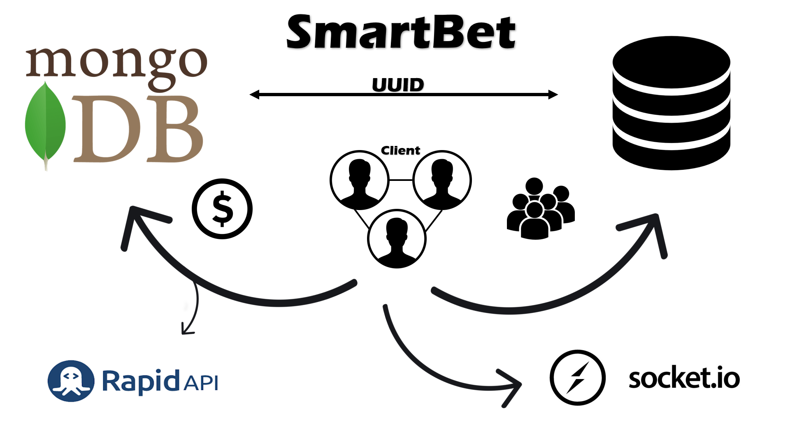
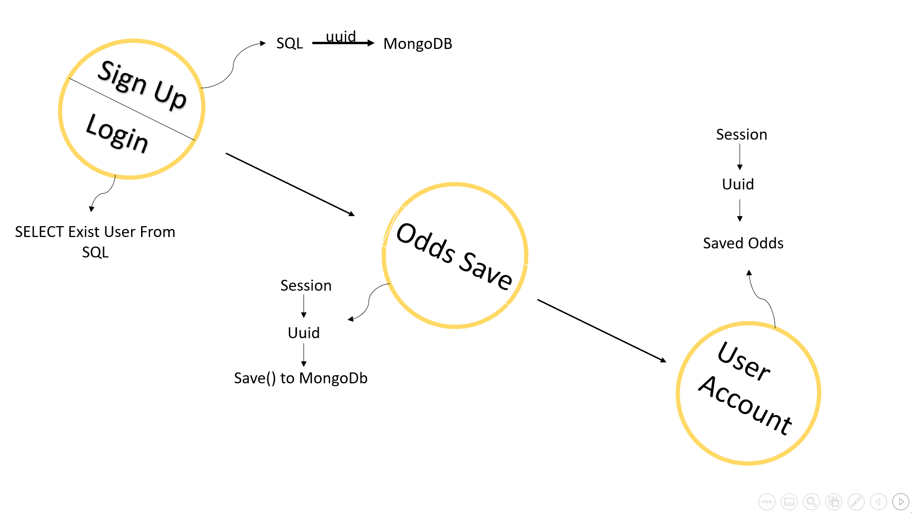
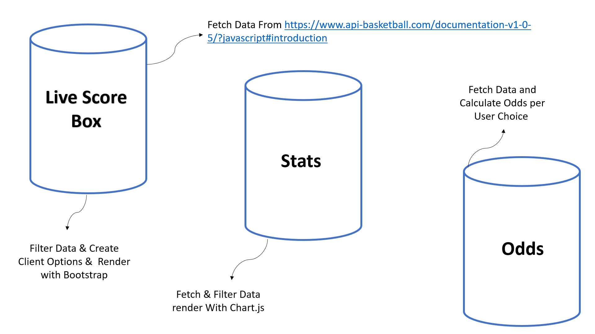
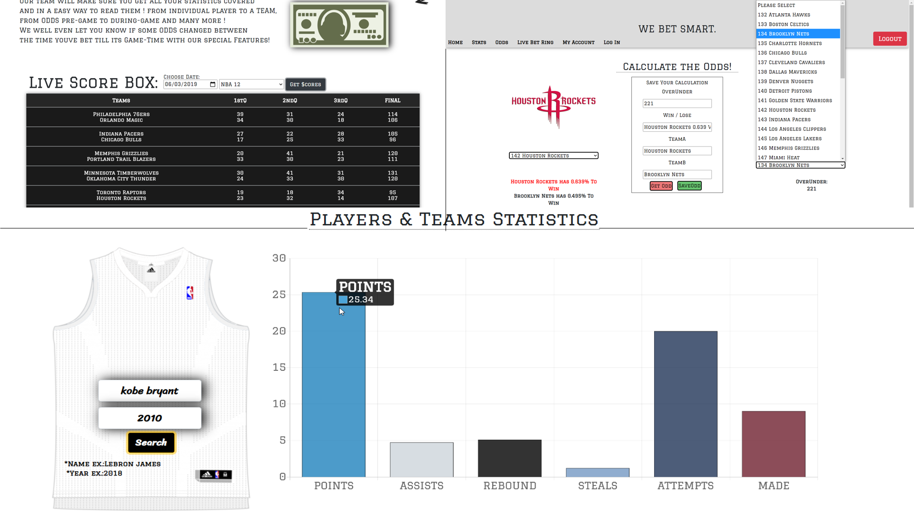
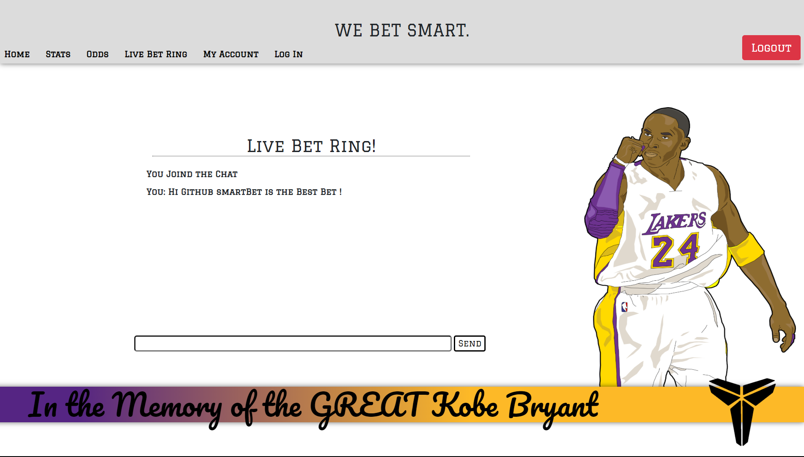

# SmartBet

SmartBet is a Smart algorithm that helps Basketball Bettors around the world increase 
their chances of winning the prize in each bet, by allowing its users to bet a smart stats based Bet.

# Project Architecture:


  
# Backgroud:

When was the last time you heard of social stats based Sport Bets ?!  <br>
SmartBet Algorithm was made specifically for that.
We give the bettors the statistics, calculate the numbers for them, and allow a live chat comunication between them. 
The live chat will allow users to get insights on other opinions on the results of upcoming games, while increasing their chances to win the bet and get the right numbers.

# Special Features:
  - Get a live Score Box for every major league Worlwide
  - Get Stats for every Player & Team in the NBA in the past 20 Years
  - Get Odds for upcoming games based on current season Stats Calculation

# DB WorkFlow:




### Tech

* [node.js] - evented I/O for the backend
* [VanillaJS] - fast, lightweight, cross-platform framework.
* [SQL] - standard language for storing, manipulating and retrieving data in databases.
* [MongoDB] - general purpose, document-based, distributed database built for modern application developers and for the cloud era.
* [Twitter Bootstrap] - great UI boilerplate for modern web apps
* [Express] - fast node.js network app framework [@tjholowaychuk]
* [Session] - create mechanism that allow Users to get identified
* [@Hapi/Joi] - The most powerful schema description language and data validator for JavaScript.
* [bcrypt] - A library that help you hash passwords.
* [body-parser] - parses the JSON, buffer, string and URL encoded data submitted using HTTP POST request.
* [ejs] - a simple templating language that lets you generate HTML markup with plain JavaScript. 
* [express-socket.io-session] - allow us to Share a cookie-based express-session middleware with socket.io .
* [jsonwebtoken] - An implementation of JSON Web Tokens.
* [mongoose] - provides a straight-forward, schema-based solution to model your application data.
* [mysql] - a node.js driver for mysql. 
* [socket.io ] - enables real-time, bidirectional and event-based communication between the browser and the server.
* [nodemon] - Simple monitor script for use during development of a node.js app.
* [Chart.js] - Simple, clean and engaging HTML5 based JavaScript charts.


# RestApi WorkFlow:






# Users Communication:
  - Users able to Live Chat with Other Users to share their Bet approach to Upcoming games
  
  


### Installation

SmartBet requires [Node.js](https://nodejs.org/) v4+ to run.

Install the dependencies and devDependencies and start the server.

```sh
$ npm install 
$ node run start
```
